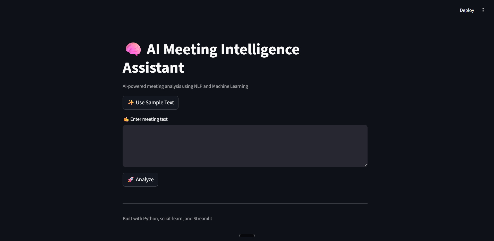
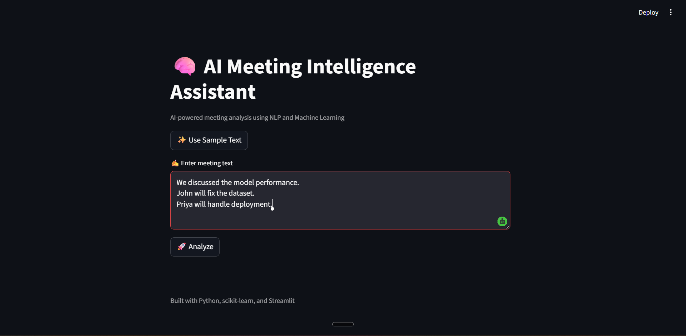
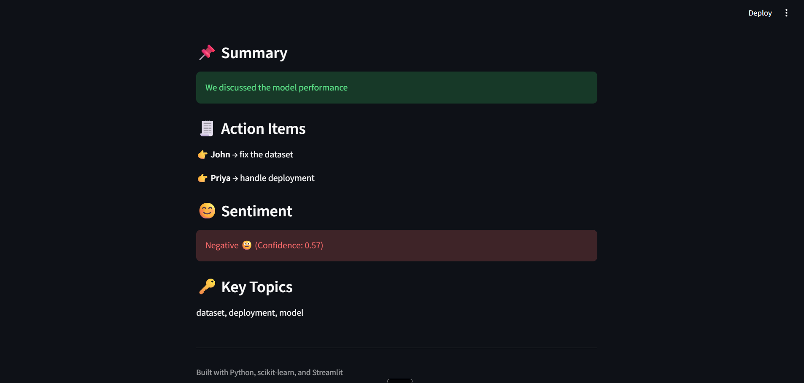

# 🧠 AI Meeting Intelligence Assistant

> An AI-powered meeting analysis application built with **Python**, **Streamlit**, and **Machine Learning** that automatically generates meeting summaries, extracts action items, analyzes sentiment, and identifies key discussion topics from meeting transcripts.


---

# 📖 Overview

Meetings often generate large amounts of information, making it difficult to quickly identify key decisions, assigned tasks, and important discussion points.

The **AI Meeting Intelligence Assistant** simplifies this process by automatically analyzing meeting transcripts and presenting meaningful insights through an interactive Streamlit application.

The application performs multiple Natural Language Processing (NLP) tasks including:

- Meeting summarization
- Action item extraction
- Sentiment analysis
- Topic identification

---

# ✨ Features

- 📌 Automatic Meeting Summary Generation
- 📝 Action Item Extraction using Regular Expressions
- 😊 Sentiment Analysis using Logistic Regression
- 🔑 Keyword & Topic Extraction using TF-IDF
- 💻 Interactive Streamlit Web Interface
- 🖥️ Command-Line Version Included
- ⚡ Lightweight and Easy to Run

---

# 🏗️ System Workflow

```text
                Meeting Transcript
                        │
                        ▼
              Text Preprocessing
                        │
        ┌───────────────┼────────────────┐
        ▼               ▼                ▼
 Summary          Action Items     Sentiment Analysis
        │               │                │
        └───────────────┼────────────────┘
                        ▼
               Topic Extraction
                        │
                        ▼
          Streamlit Dashboard Output
```

---

# 🛠️ Tech Stack

| Category | Technology |
|----------|------------|
| Language | Python |
| Framework | Streamlit |
| Machine Learning | scikit-learn |
| NLP | Regular Expressions, CountVectorizer, TF-IDF |
| IDE | Visual Studio Code |
| Version Control | Git & GitHub |

---

# 📂 Project Structure

```text
AI-Meeting-Intelligence-Assistant/
│
├── app.py
├── main.py
├── requirements.txt
├── README.md
├── .gitignore
└── assets/
```

---

# 🚀 Installation

Clone the repository:

```bash
git clone https://github.com/Karunya0403/AI-Meeting-Intelligence-Assistant.git
```

Navigate to the project folder:

```bash
cd AI-Meeting-Intelligence-Assistant
```

Install the required packages:

```bash
pip install -r requirements.txt
```

Run the Streamlit application:

```bash
streamlit run app.py
```

---

# 💡 Example Input

```text
We discussed the model performance.

John will fix the dataset.

Priya will handle deployment.

The meeting went well.
```

---

# 📈 Example Output

### 📌 Summary

```
We discussed the model performance.
```

### 📝 Action Items

- John → Fix the dataset
- Priya → Handle deployment

### 😊 Sentiment

Positive 😊

### 🔑 Key Topics

- Model
- Dataset
- Deployment

---

# 📸 Screenshots

## 🏠 Home Page



---

## ✍️ Sample Meeting Input



---

## 📊 Analysis Results



# 🔮 Future Enhancements

- Transformer-based text summarization (BERT/T5)
- Speech-to-text meeting transcription
- Large Language Model (LLM) integration
- Named Entity Recognition (NER)
- PDF report generation
- Meeting analytics dashboard
- Calendar integration
- Speaker identification

---

# 🎯 Learning Outcomes

Through this project I gained practical experience with:

- Natural Language Processing (NLP)
- Text preprocessing
- Regular Expressions
- TF-IDF Feature Extraction
- CountVectorizer
- Machine Learning using Logistic Regression
- Streamlit application development
- End-to-End AI application development
- Git & GitHub version control

---

# 🤝 Contributing

Contributions, suggestions, and improvements are always welcome.

Feel free to fork the repository and submit a pull request.

---

# 📄 License

This project is licensed under the **MIT License**.

---

# 👨‍💻 Author

**Karunya G K**

B.Tech – Artificial Intelligence and Data Science

Passionate about AI Engineering, Machine Learning, NLP, and Intelligent Automation.

📧 **LinkedIn:** *(Add your LinkedIn profile link here)*

⭐ If you found this project useful, consider giving it a star!